# PLSS Grid for ATAK — User Guide

**Version 0.3 · takwerx**

PLSS Grid draws the Public Land Survey System — townships, ranges and sections —
on the ATAK map as a live overlay, from the Bureau of Land Management's own
survey data. It works fully offline once you have downloaded the states you
work in.

---

## 1. What the PLSS is, in one minute

Most of the United States west of Ohio was surveyed into a rectangular grid:

- A **principal meridian** and base line anchor each survey region (the Mount
  Diablo Meridian, San Bernardino Meridian, Boise Meridian, and so on — there
  are about three dozen).
- **Townships** are 6-mile squares, counted north or south of the base line
  (**T9N** = the ninth township north) and east or west of the meridian
  (**R28W** = the 28th range west). A township is named by both: **T9N‑R28W**.
- Each township is cut into 36 **sections** of one square mile, numbered 1–36
  starting at the north‑east corner and snaking back and forth.

So a PLSS address reads like a radio call: *"San Bernardino Meridian, Township
16 South, Range 11 East, Section 21."* Wildland fire and public‑land operations
use it for division assignments, drop points, contingency lines and legal
descriptions. ATAK ships MGRS and USNG grids, but nothing for PLSS — this plugin
fills that gap.

> **The township and range numbers restart at every principal meridian.**
> "T1N‑R1W" exists under most meridians, hundreds of miles apart. The meridian
> is part of the address, which is why the plugin always asks for it.

---

## 2. Before you start

- **Match the plugin to your ATAK version.** Plugin builds are tied to the ATAK
  release they were built for (5.7 and 5.8 builds are published). A mismatched
  build will not load.
- **Install and load the plugin** through ATAK's *Plugins* manager (TAK Package
  Mgmt), the same as any other plugin.
- **The plugin ships with no map data.** On first use you download the states
  you need — Wi‑Fi is a good idea; state packs run from about 6 MB to 124 MB.
  A typical western operating area of three or four states is under 100 MB.
- The plugin makes **no other network calls**. It talks outbound over HTTPS
  (port 443) only while you are downloading data, never to the TAK server, and
  generates no CoT. After the download it works in airplane mode.

---

## 3. Step by step

### Step 1 — Open the plugin

Tap the menu (☰) → **Tools** → **PLSS Grid**. After the first load you may also
find it in the toolbar.

### Step 2 — The PLSS pane

Three buttons and two color swatches. That's the whole interface.

- **Manage map data…** — download and delete state packs.
- **Find township…** — jump the map to a township by meridian, township and range.
- **Show / Hide PLSS overlay** — turn the grid on and off.
- **Township lines & labels** / **Section lines & labels** — color per tier.

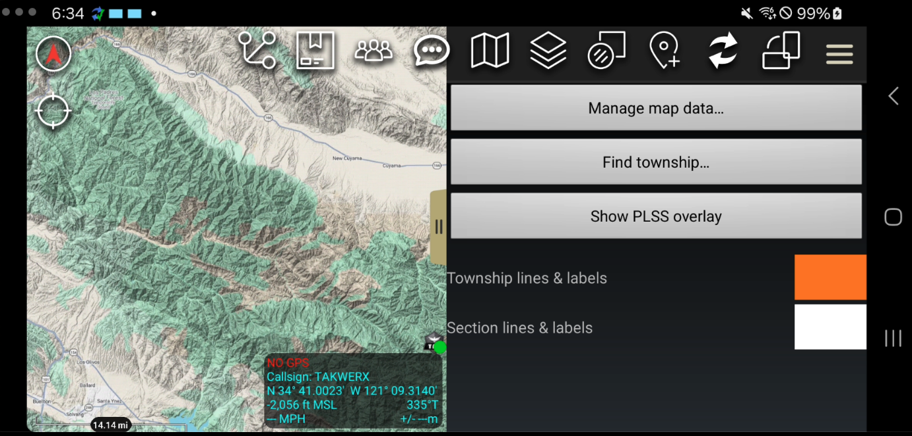

### Step 3 — Manage map data

The data dialog shows the BLM source date at the top, what is installed, and
every state available to download with its size and section count. Pick the
states you operate in — you can add more at any time.

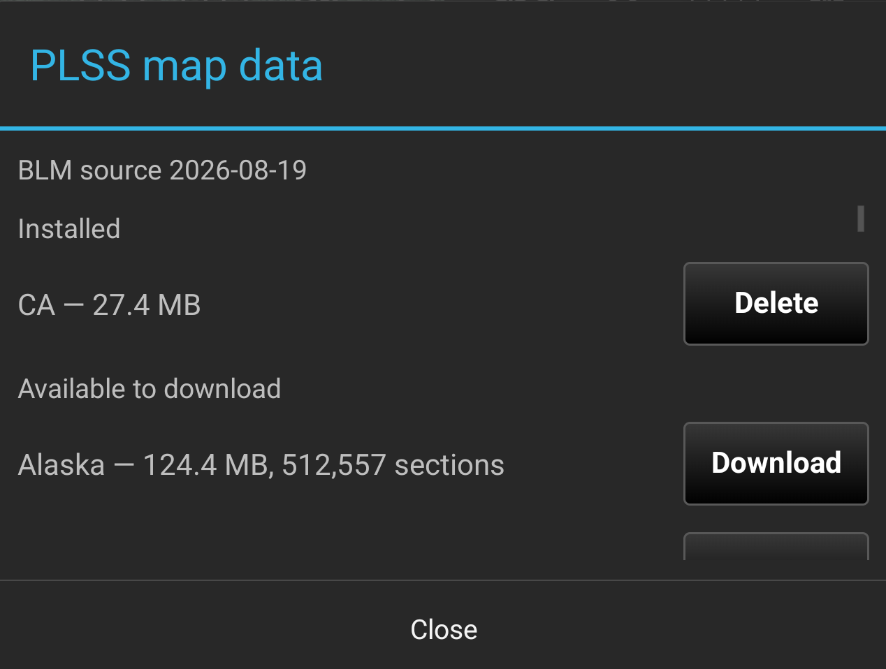

### Step 4 — Download a state

Tap **Download**. A progress bar tracks the transfer. Downloads resume if
interrupted, and every pack is verified against its published SHA‑256 digest
before it is installed.

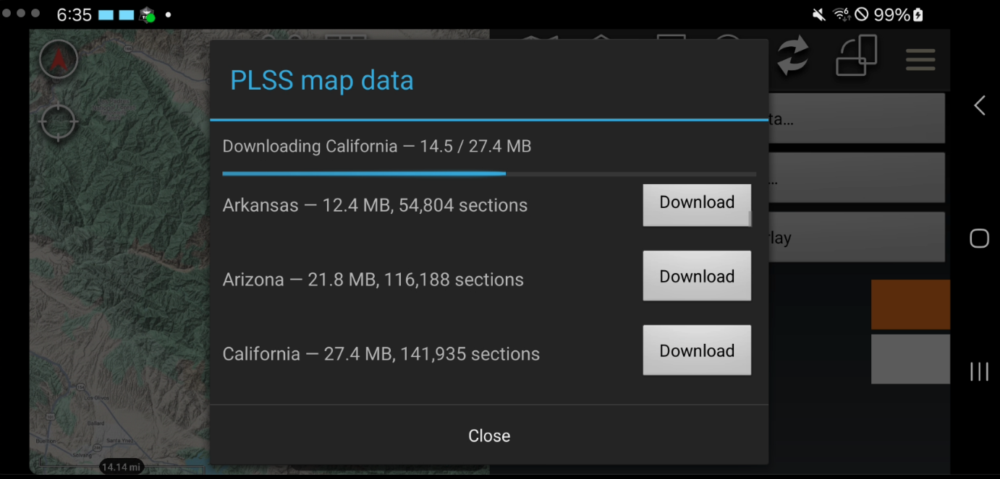

### Step 5 — Installed

Installed states move to the top with a **Delete** button for freeing space
later. Neighboring states can be installed together — the plugin merges them
cleanly along the border (see section 4 below).

### Step 6 — Show the overlay: townships first

Tap **Show PLSS overlay**. Zoomed out you see the **township** grid (orange by
default) with each township's name — T9N‑R28W and its neighbors here.

The overlay draws in two tiers by zoom so the map stays readable and fast:
townships appear first; sections switch on as you zoom closer. Zoomed far out,
nothing is drawn on purpose — at that scale the grid would be solid ink.

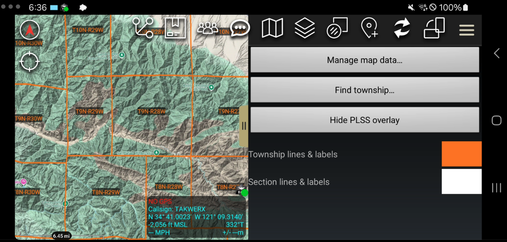

### Step 7 — Zoom in: sections

Closer in, the **sections** appear (white by default) with their numbers
1–36, one per square mile, and the township name stays in the middle of its
block. Numbers and names keep the same size on screen at every zoom.

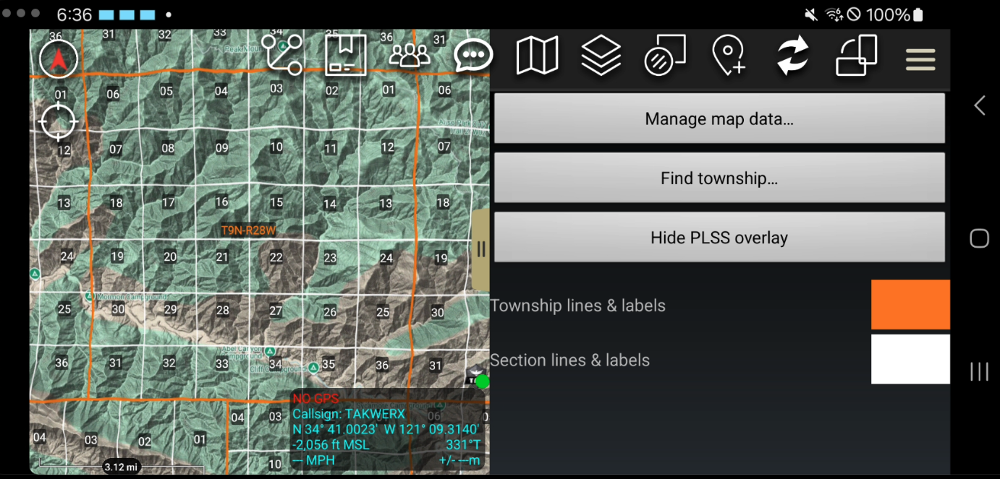

### Step 8 — Township color

Tap the **Township lines & labels** swatch. One pick recolors that tier's
lines *and* labels together. Dark colors are fine — the label backdrop flips
to light automatically so the text stays readable. Your choice is remembered
across ATAK restarts.

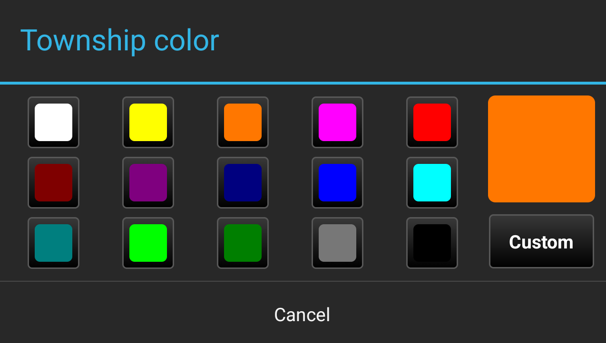

### Step 9 — Section color

Same for **Section lines & labels**. Ship defaults are orange townships and
white sections, which read well on most basemaps.

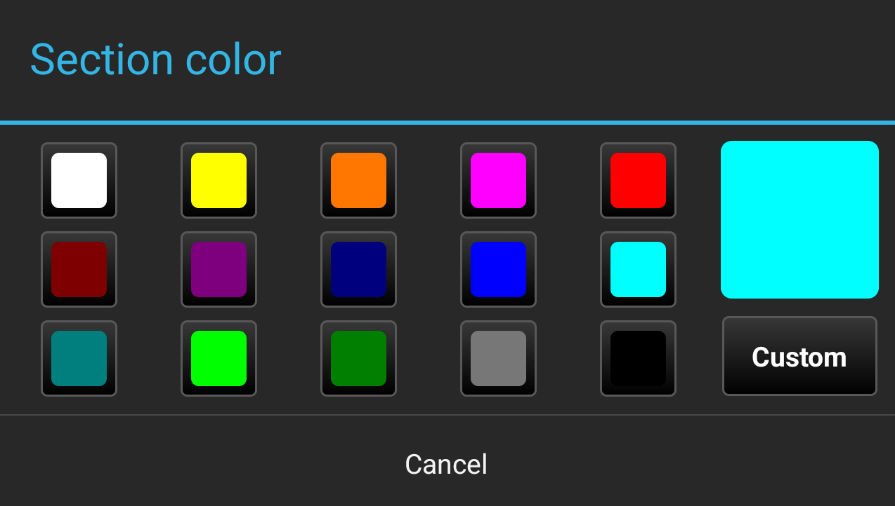

### Step 10 — Find a township

**Find township…** asks for the **principal meridian** (tap the button for the
list), the **township** number with N/S, and the **range** number with E/W.
Only meridians present in your installed data are offered.

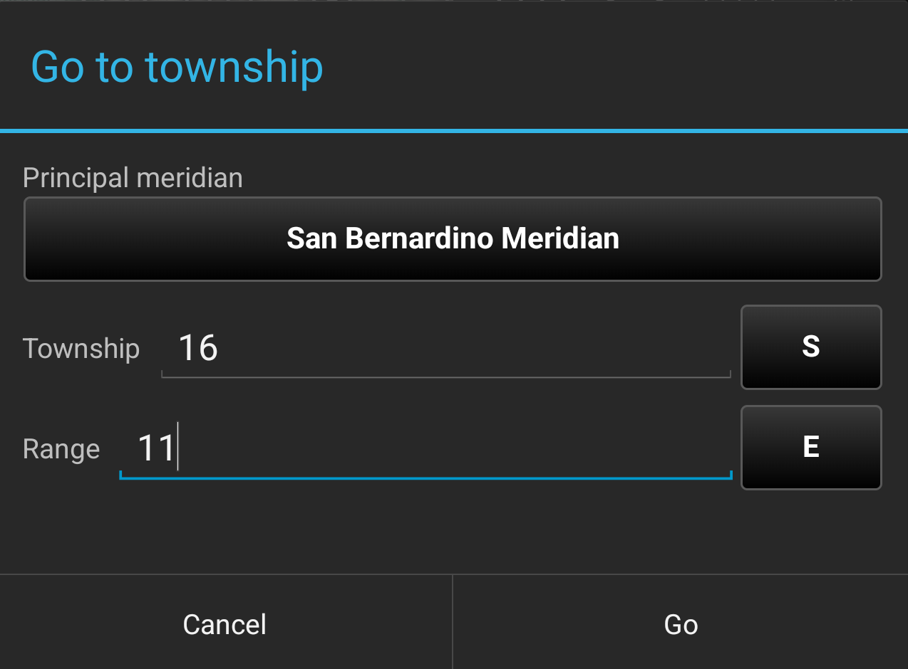

### Step 11 — Landed

**Go** centers the map on the township and zooms so it fills the screen —
here T16S‑R11E under the San Bernardino Meridian, Imperial Valley.

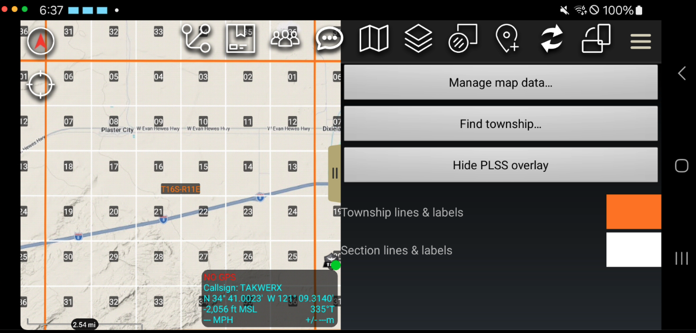

### Step 12 — Overlay Manager

The overlay is also listed in ATAK's **Overlay Manager** under **Other
Overlays → PLSS**, beside ATAK's own Grid Lines. The eyeball there and the
pane's Show/Hide button are the same switch.

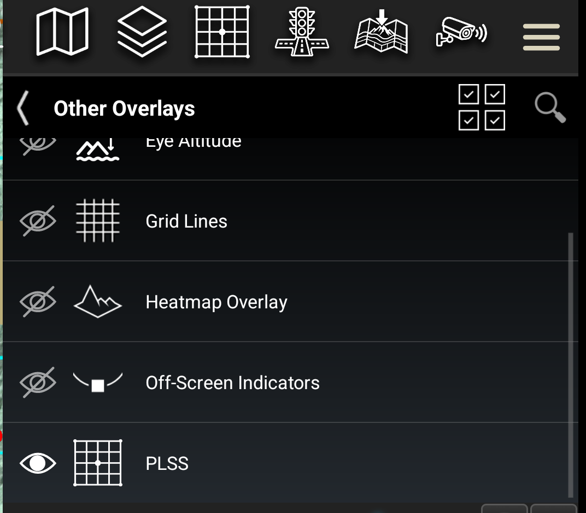

---

## 4. What you will see along state lines

BLM publishes the survey **one state at a time, clipped at the state boundary**.
A township that straddles a state line therefore exists in two files — the
California half and the Nevada half — each with its own outline. The plugin
handles this, but it is worth knowing what you are looking at:

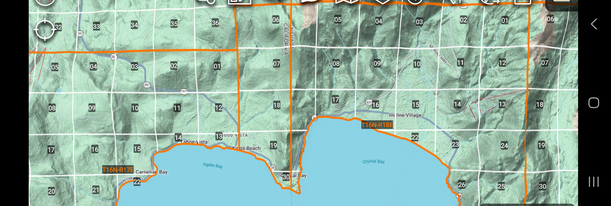

- **Each township and each section is named once.** With both states
  installed, the plugin recognizes the two halves as the same feature and
  centers a single name on the whole of it. Without the neighboring state
  installed you simply see nothing on the far side of the line.
- **You will see a line running along the state boundary.** That is the edge
  where BLM cut the data, not a survey line. The narrow cells it creates next to
  the border are the two halves of genuine sections, not extra sections — each
  carries one number.
- **Lakes and rivers are the same story, and real.** Sections that meet a
  large lake or a navigable river stop at the surveyed *meander line* of the
  shore. Those irregular cells are the actual survey.
- **Gaps are real too.** The rectangular survey went around Spanish and Mexican
  land grants, so there is no PLSS beneath much of coastal and southern
  California, and sparse or irregular sections in land‑grant country are the
  data, not a fault.

---

## 5. Good to know

- **The overlay starts hidden** each time ATAK launches (like ATAK's own
  grids). Turn it on from the pane or the Overlay Manager; your colors persist.
- **Sections only draw once you are zoomed in far enough**; townships only
  below a wider threshold. If you see nothing, zoom in.
- **After updating the plugin**, ATAK unloads it: reload it from the Plugins
  manager and turn the overlay back on.
- **Multiple states** can be installed side by side; delete one from the data
  dialog to free storage.
- **Data source**: BLM National PLSS CadNSDI — the authoritative survey record
  (USGS products derive from it). The source date is shown at the top of the
  data dialog.

---

## 6. Contact

Andreas Johansson · takwerx · questions and issues: https://github.com/takwerx/atak-plugins/issues
